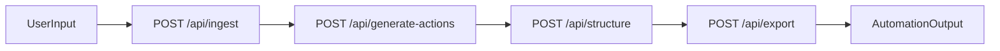

 # Repo Surgeon

Legacy code triage pipeline for the Tech Europe: London AI Hackathon (Conduct Track):

Inspired by Conduct's Track at the Hackathon today, we created a tool that enables you to automate the review and triaging of legagy code.  This tool will allow enterprises to review their legacy repos, and target the highest impact improvements - reducing complexity and increasing efficiency!

How to use Repo Surgeon? 

input a link to your repo -> generate verified improvements -> repo surgeon creates structured tickets -> export automations instantly connect your slack and github issues.


## How to use the tool

1. **Access the application**  
   Open [https://londonaihackathon.vercel.app/](https://londonaihackathon.vercel.app/) in your browser.

2. **Run against any public GitHub repo**  
   Choose **Repo URL** mode, paste a public GitHub repository URL (e.g. `https://github.com/huang-jiaming/fake_repo`), optionally set a language hint, then click **Run analysis**. The pipeline will ingest the repo, analyze it, generate action items, structure tickets, and export (Slack + GitHub Issues when configured).

3. **See the Slack integration**  
   Join our Slack channel to see delivery summaries and issue links when runs complete:  
   [Join Slack workspace](https://join.slack.com/t/erdincmutluworkspace/shared_invite/zt-3r27o8r9s-Cft8pEOljKZhLvCkGo2Mmg)

4. **See created GitHub issues**  
   Issues created by the tool are published to our demo repo:  
   [https://github.com/huang-jiaming/hackathon-issues/issues](https://github.com/huang-jiaming/hackathon-issues/issues)

## Hackathon partner technologies used

This project uses the required 3+ partner technologies:

1. **DeepMind / Gemini** (Step 1 + Step 2)
   - Repository analysis
   - Action-item generation + self-verification loop
2. **Dust** (Step 3)
   - Agent-based conversion from free text to strict JSON tickets
3. **CodeWords** (Step 4)
   - Automation/orchestration of delivery payloads
   - Critical path before downstream delivery

Additional Integrations:

4. **GitHub Issues** (Delivery target)
   - Creates execution-ready issues for engineering teams
5. **Slack** (Delivery target)
   - Posts summary and issue links to team channel

## Architecture

Each service is independent so teammates can build in parallel. The frontend calls them in order.



## Repository layout

- `src/app/page.tsx`: frontend orchestration UI (Repo URL / Direct Code modes, workflow timeline, metrics)
- `src/app/api/ingest/route.ts`: Step 1 endpoint
- `src/app/api/generate-actions/route.ts`: Step 2 endpoint
- `src/app/api/structure/route.ts`: Step 3 endpoint
- `src/app/api/export/route.ts`: Step 4 endpoint
- `src/app/api/pipeline/route.ts`: optional one-call pipeline route
- `src/app/api/stats/route.ts`: dashboard stats (repos scanned, issues created, open issues)
- `src/lib/steps.ts`: step implementations
- `src/lib/stats.ts`: stats persistence and GitHub open-issues count
- `src/lib/types.ts`: strict shared contracts
- `docs/STEP1_SPEC.md` ... `docs/STEP4_SPEC.md`: teammate specs
- `docs/DEMO_SCRIPT.md`: hackathon demo script with timing and talking points
- `docs/CURSOR_AGENT_HANDOFF.md`: Cursor collaboration playbook
- `docs/ENGINEERING_PLAN.md`: execution and architecture plan
- `docs/INTEGRATION_REVIEW.md`: full setup + token + integration checklist
- `docs/DEPLOY_GITHUB_PAGES.md`: production deployment split (Vercel + Pages)
- `docs/IMPLEMENTATION_STATUS.md`: current implementation and local test status
- `data/`: persisted stats (repos-scanned.json); gitignored

## Current implementation status

- **Step 1:** Gemini ingest/review from repo URL or pasted code
- **Step 2:** Gemini action generation + self-verification loop
- **Step 3:** Dust structuring to strict ticket JSON
- **Step 4:** CodeWords orchestration → Slack summary (GitHub issue creation handled by CodeWords)
- **UI:** Single-page flow with Repo URL / Direct Code modes, workflow timeline, step result cards, and dashboard metrics

## Setup

### 1) Install

```bash
npm install
```

### 2) Configure environment

Copy and fill env vars:

```bash
cp .env.example .env.local
```

Required vars:
- `GEMINI_API_KEY`
- `DUST_API_KEY`
- `DUST_WORKSPACE_ID`
- `DUST_AGENT_ID`
- `CODEWORDS_API_KEY`
- `CODEWORDS_SERVICE_ID`
- `GITHUB_ISSUES_TOKEN`
- `GITHUB_ISSUES_OWNER`
- `GITHUB_ISSUES_REPO`
- `SLACK_WEBHOOK_URL`
- `NEXT_PUBLIC_API_BASE_URL` (optional; required for static frontend deployments)

Optional:
- `GITHUB_TOKEN` (higher GitHub API rate limits for Step 1; also used for “Issues still open” dashboard metric if `GITHUB_ISSUES_TOKEN` is not set)

### 3) Run

```bash
npm run dev
```

Open `http://localhost:3000`.

## Production deploy (GitHub Pages)

GitHub Pages is static-only and cannot run Next.js API routes. Deploy as:
- Backend API on Render/Railway/Vercel
- Frontend on GitHub Pages calling backend via `NEXT_PUBLIC_API_BASE_URL`

Detailed guide: `docs/DEPLOY_GITHUB_PAGES.md`

## API contract

### Step 1 - Ingest
`POST /api/ingest`

Input:
```json
{
  "repoUrl": "https://github.com/owner/repo",
  "codeInput": "optional",
  "language": "python"
}
```

Output:
```json
{
  "summary": "string",
  "architecture": "string",
  "fileBreakdown": "string",
  "legacyPatterns": "string",
  "dependencies": "string",
  "concerns": "string"
}
```

### Step 2 - Generate actions
`POST /api/generate-actions`

Input:
```json
{ "analysis": { "...": "from step 1" } }
```

Output:
```json
{
  "actions": "string",
  "verificationNotes": "string"
}
```

### Step 3 - Structure
`POST /api/structure`

Input:
```json
{
  "actions": "string",
  "verificationNotes": "string"
}
```

Output:
```json
{
  "tickets": [
    {
      "id": "T-001",
      "priority": "P0",
      "title": "string",
      "description": "string",
      "category": "migration",
      "effort": "small",
      "acceptanceCriteria": ["string"]
    }
  ],
  "summary": "string"
}
```

### Step 4 - Export (CodeWords → Slack)
`POST /api/export`

Input (either raw structured output or with repo context):
```json
{
  "structured": {
    "tickets": [{ "id": "T-001", "priority": "P0", "title": "...", "description": "...", "category": "migration", "effort": "small", "acceptanceCriteria": [] }],
    "summary": "string"
  },
  "repoContext": { "repoName": "optional", "repoUrl": "optional" }
}
```

Output:
```json
{
  "success": true,
  "ticketsCreated": 12,
  "slackStatus": "sent",
  "slackMessageTsOrId": "optional",
  "provider": "codewords",
  "rawResponse": {},
  "notes": "GitHub issue creation is handled by Codewords."
}
```

On failure: `success: false`, `provider: "fallback"`, `csvContent` with CSV fallback, and `notes` describing the error.

### Stats (dashboard)
`GET /api/stats`

Output:
```json
{
  "reposScanned": 0,
  "issuesCreated": 0,
  "issuesOpen": 0
}
```

`issuesOpen` is omitted when GitHub API is not configured (`GITHUB_ISSUES_TOKEN`, `GITHUB_ISSUES_OWNER`, `GITHUB_ISSUES_REPO`). Open count uses issues with the `repo-surgeon` label in the target repo.

## Demo script (2 minutes)

See **`docs/DEMO_SCRIPT.md`** for a full presentation script with timing and talking points (intro, UI walkthrough, run pipeline, results, partner tech recap, outro).

## Team workflow with Cursor

1. Split into 4 branches by step ownership.
2. Each teammate uses their `docs/STEP*_SPEC.md` as Cursor prompt.
3. Merge against shared type contracts in `src/lib/types.ts`.
4. Integration owner validates end-to-end flow from the frontend.
5. Review and execute `docs/INTEGRATION_REVIEW.md`.

## Submission checklist (hackathon)

- Public GitHub repository with source code
- README with setup + technical documentation
- 2-minute demo video link
- Explicit mention of 3 partner technologies used

## Video demo

- Loom link: `TODO_ADD_LINK_BEFORE_SUBMISSION`
