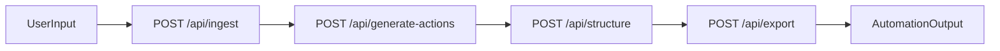

# Repo Surgeon

Legacy code triage pipeline for the London Hackathon (Conduct/Open track): ingest repo -> generate verified improvements -> structure tickets -> export automations.

## Why this project

Teams often fail by building too much. Repo Surgeon focuses on one tight loop that is easy to demo in 2 minutes:
- Input a repo URL or pasted legacy code
- Produce architecture/risk analysis
- Turn analysis into prioritized, verified action items
- Convert into structured tickets and export automatically

## Hackathon partner technologies used

This project uses the required 3+ partner technologies:

1. **DeepMind / Gemini** (Step 1 + Step 2)
   - Repository analysis
   - Action-item generation + self-verification loop
2. **Dust** (Step 3)
   - Agent-based conversion from free text to strict JSON tickets
3. **CodeWords** (Step 4)
   - Automation/orchestration of delivery payloads
   - Critical path before downstream delivery
4. **GitHub Issues** (Delivery target)
   - Creates execution-ready issues for engineering teams
5. **Slack** (Delivery target)
   - Posts summary and issue links to team channel

## Architecture

Each service is independent so teammates can build in parallel. The frontend calls them in order.



## Repository layout

- `src/app/page.tsx`: frontend orchestration UI
- `src/app/api/ingest/route.ts`: Step 1 endpoint
- `src/app/api/generate-actions/route.ts`: Step 2 endpoint
- `src/app/api/structure/route.ts`: Step 3 endpoint
- `src/app/api/export/route.ts`: Step 4 endpoint
- `src/app/api/pipeline/route.ts`: optional one-call pipeline route
- `src/lib/steps.ts`: step implementations
- `src/lib/types.ts`: strict shared contracts
- `docs/STEP1_SPEC.md` ... `docs/STEP4_SPEC.md`: teammate specs
- `docs/CURSOR_AGENT_HANDOFF.md`: Cursor collaboration playbook
- `docs/ENGINEERING_PLAN.md`: execution and architecture plan

## Setup

### 1) Install

```bash
npm install
```

### 2) Configure environment

Copy and fill env vars:

```bash
cp .env.example .env.local
```

Required vars:
- `GEMINI_API_KEY`
- `DUST_API_KEY`
- `DUST_WORKSPACE_ID`
- `DUST_AGENT_ID`
- `CODEWORDS_API_KEY`
- `CODEWORDS_SERVICE_ID`
- `GITHUB_ISSUES_TOKEN`
- `GITHUB_ISSUES_OWNER`
- `GITHUB_ISSUES_REPO`
- `SLACK_WEBHOOK_URL`
- `NEXT_PUBLIC_API_BASE_URL` (optional; required for static frontend deployments)

Optional:
- `GITHUB_TOKEN` (higher GitHub API rate limits for Step 1)

### 3) Run

```bash
npm run dev
```

Open `http://localhost:3000`.

## Production deploy (GitHub Pages)

GitHub Pages is static-only and cannot run Next.js API routes. Deploy as:
- Backend API on Render/Railway/Vercel
- Frontend on GitHub Pages calling backend via `NEXT_PUBLIC_API_BASE_URL`

Detailed guide: `docs/DEPLOY_GITHUB_PAGES.md`

## API contract

### Step 1 - Ingest
`POST /api/ingest`

Input:
```json
{
  "repoUrl": "https://github.com/owner/repo",
  "codeInput": "optional",
  "language": "python"
}
```

Output:
```json
{
  "summary": "string",
  "architecture": "string",
  "fileBreakdown": "string",
  "legacyPatterns": "string",
  "dependencies": "string",
  "concerns": "string"
}
```

### Step 2 - Generate actions
`POST /api/generate-actions`

Input:
```json
{ "analysis": { "...": "from step 1" } }
```

Output:
```json
{
  "actions": "string",
  "verificationNotes": "string"
}
```

### Step 3 - Structure
`POST /api/structure`

Input:
```json
{
  "actions": "string",
  "verificationNotes": "string"
}
```

Output:
```json
{
  "tickets": [
    {
      "id": "T-001",
      "priority": "P0",
      "title": "string",
      "description": "string",
      "category": "migration",
      "effort": "small",
      "acceptanceCriteria": ["string"]
    }
  ],
  "summary": "string"
}
```

### Step 4 - Export (CodeWords -> GitHub Issues + Slack)
`POST /api/export`

Input:
```json
{
  "tickets": [],
  "summary": "string"
}
```

Output:
```json
{
  "success": true,
  "ticketsCreated": 12,
  "issuesCreatedCount": 12,
  "issueLinks": ["https://github.com/owner/repo/issues/123"],
  "slackStatus": "sent",
  "provider": "codewords"
}
```

Fallback output includes `csvContent` if external automation fails.

## Demo script (2 minutes)

1. Open UI and click sample input.
2. Run sequential orchestration.
3. Show each step output block appearing in order.
4. Highlight partner tech usage:
   - Gemini for analysis + verification
   - Dust for JSON structuring
   - CodeWords for delivery orchestration
5. Show created GitHub Issues and Slack summary delivery.
6. Show fallback CSV to prove reliability under failure.

## Team workflow with Cursor

1. Split into 4 branches by step ownership.
2. Each teammate uses their `docs/STEP*_SPEC.md` as Cursor prompt.
3. Merge against shared type contracts in `src/lib/types.ts`.
4. Integration owner validates end-to-end flow from the frontend.
5. Review and execute `docs/INTEGRATION_REVIEW.md`.

## Submission checklist (hackathon)

- Public GitHub repository with source code
- README with setup + technical documentation
- 2-minute demo video link
- Explicit mention of 3 partner technologies used

## Video demo

- Loom link: `TODO_ADD_LINK_BEFORE_SUBMISSION`
