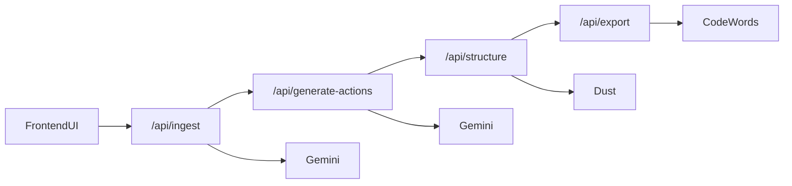

# Repo Surgeon Engineering Plan

## Goal
Ship a demoable, reliable pipeline in 3 hours:
1. Ingest legacy repo/code
2. Generate and self-verify action items
3. Structure action items into ticket JSON
4. Export to automation target

The frontend orchestrates calls in order so each teammate can build independently and integrate fast.

## System Design

## Collaboration Contract
- **Independence**: each step has a dedicated endpoint and strict input/output schema.
- **Order**: UI sequentially calls Step 1 -> Step 2 -> Step 3 -> Step 4.
- **Fallbacks**: Step 4 returns CSV fallback if CodeWords is unavailable.
- **No shared DB**: all state is passed in API payloads for speed.

## Ownership
- Step 1 (`/api/ingest`) - Riley
- Step 2 (`/api/generate-actions`) - Carter
- Step 3 (`/api/structure`) - Krysten
- Step 4 (`/api/export`) - Erdinc

## Execution Timeline
- 0:00-0:20 scaffold + env + route contracts
- 0:20-1:30 teammates implement step logic in parallel
- 1:30-2:15 integration and schema fixes
- 2:15-2:45 demo polish + sample inputs
- 2:45-3:00 Loom recording + submission
