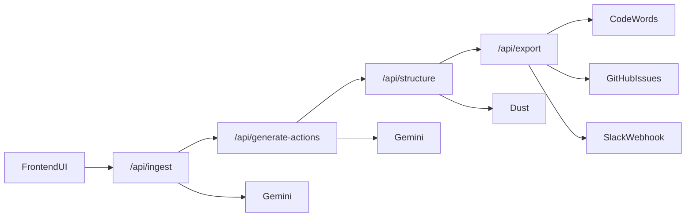

# Repo Surgeon Engineering Plan

## Goal
Ship a demoable, reliable pipeline in 3 hours:
1. Ingest legacy repo/code
2. Generate and self-verify action items
3. Structure action items into ticket JSON
4. Use CodeWords automation to deliver GitHub Issues and Slack updates

The frontend orchestrates calls in order so each teammate can build independently and integrate fast.

## System Design

## Collaboration Contract
- **Independence**: each step has a dedicated endpoint and strict input/output schema.
- **Order**: UI sequentially calls Step 1 -> Step 2 -> Step 3 -> Step 4.
- **Step 4 critical path**: CodeWords transforms payload before delivery.
- **Delivery targets**: Step 4 creates GitHub Issues and posts Slack summary.
- **Fallbacks**: if external calls fail, return per-target status and CSV fallback.
- **No shared DB**: all state is passed in API payloads for speed.

## Ownership
- Step 1 (`/api/ingest`) - Riley
- Step 2 (`/api/generate-actions`) - Carter
- Step 3 (`/api/structure`) - Krysten
- Step 4 (`/api/export`) - Erdinc
- Integration + UI polish - shared

## UI Direction (Steve Jobs Theme)
- Black/white minimal layout with strong typography hierarchy.
- Single primary CTA and linear progress storytelling.
- One-page narrative: input -> what we found -> what we generated -> where we sent it.
- Keep copy short and declarative for stage demo.

## Execution Timeline
- 0:00-0:20 scaffold + env + route contracts
- 0:20-1:30 teammates implement step logic in parallel
- 1:30-2:15 integration and schema fixes
- 2:15-2:45 demo polish + Steve Jobs style UI copy
- 2:45-3:00 Loom recording + submission
